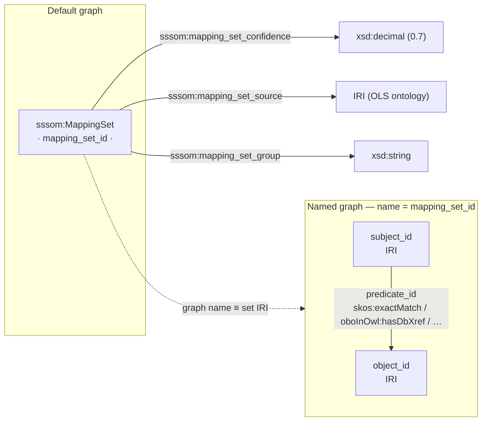

# Schema — named-graph rendering (TriG)

In the TriG rendering each **mapping set** becomes one **named graph** (graph IRI =
`mapping_set_id`). The set-level provenance is asserted about that IRI in the **default graph**;
the core `subject → predicate → object` triples live **inside** the named graph.



## ShEx

The per-set resource and the mapped term **are** expressible in ShEx. The *grouping into a named
graph* is a dataset-level construct and is **not** part of ShEx — it is enforced by the serializer,
not by a shape.

```shex
PREFIX sssom:    <https://w3id.org/sssom/>
PREFIX skos:     <http://www.w3.org/2004/02/skos/core#>
PREFIX oboInOwl: <http://www.geneontology.org/formats/oboInOwl#>
PREFIX xsd:      <http://www.w3.org/2001/XMLSchema#>

# Asserted in the DEFAULT graph
<MappingSetShape> {
  a                            [ sssom:MappingSet ] ;
  sssom:mapping_set_confidence xsd:decimal ? ;
  sssom:mapping_set_source     IRI ? ;
  sssom:mapping_set_group      xsd:string ?
}

# A subject term INSIDE a named graph: it bears one or more mapping predicates to IRIs
<MappedTermShape> {
  ( skos:exactMatch
  | skos:closeMatch
  | skos:broadMatch
  | skos:narrowMatch
  | oboInOwl:hasDbXref ) IRI +
}
```

## Example (TriG)

```turtle
<https://w3id.org/commons/ols/mappings/mondo.ols.sssom.tsv> a sssom:MappingSet ;
  sssom:mapping_set_group "ols_sssom_extracts" ;
  sssom:mapping_set_confidence 0.7 ;
  sssom:mapping_set_source <https://www.ebi.ac.uk/ols4/ontologies/mondo> .

<https://w3id.org/commons/ols/mappings/mondo.ols.sssom.tsv> {
  <http://purl.obolibrary.org/obo/MONDO_0000001>
    <http://www.geneontology.org/formats/oboInOwl#hasDbXref>
    <http://purl.obolibrary.org/obo/DOID_4> .
}
```
