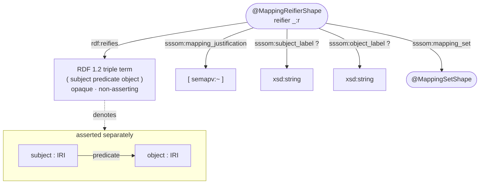

# Schema — RDF 1.2 rendering (Turtle 1.2)

> ⚠️ **ShEx 2.1 does not support RDF 1.2 yet** — there is no triple-term / `rdf:reifies`
> construct in the ShEx grammar. The shape below is therefore **ShEx-*style* pseudo-syntax**, and
> the diagram is drawn in the visual style of a ShEx schema (stadium = shape, rectangle = value).

In the RDF 1.2 rendering each mapping triple is **asserted** *and* **annotated**. The Turtle 1.2
annotation `s p o {| … |}` desugars to a **reifier** that points (via `rdf:reifies`) at the
**triple term** `<<( s p o )>>` and carries the per-mapping metadata. The triple term is *opaque*
and *non-asserting*; the base triple is asserted separately.



## ShEx-style shapes (pseudo-syntax)

```shex
# NB: rdf:reifies + triple terms (<<( s p o )>>) are RDF 1.2 — NOT valid ShEx 2.1.
PREFIX sssom:  <https://w3id.org/sssom/>
PREFIX semapv: <https://w3id.org/semapv/vocab/>
PREFIX rdf:    <http://www.w3.org/1999/02/22-rdf-syntax-ns#>
PREFIX xsd:    <http://www.w3.org/2001/XMLSchema#>

<MappingReifierShape> {
  rdf:reifies                  TRIPLE_TERM ;          # <<( subject predicate object )>>
  sssom:mapping_justification  [ semapv:~ ] ;         # an IRI in the semapv namespace
  sssom:subject_label          xsd:string ? ;
  sssom:object_label           xsd:string ? ;
  sssom:mapping_set            @<MappingSetShape>
}

<MappingSetShape> {
  a                            [ sssom:MappingSet ] ;
  sssom:mapping_set_confidence xsd:decimal ? ;
  sssom:mapping_set_source     IRI ? ;
  sssom:mapping_set_group      xsd:string ?
}
```

## Example (Turtle 1.2, RDF 1.2)

```turtle
<http://purl.obolibrary.org/obo/MONDO_0000001>
  <http://www.geneontology.org/formats/oboInOwl#hasDbXref>
  <http://purl.obolibrary.org/obo/DOID_4>
{|
  sssom:mapping_justification <https://w3id.org/semapv/vocab/UnspecifiedMatching> ;
  sssom:subject_label "disease" ;
  sssom:object_label  "disease" ;
  sssom:mapping_set   <https://w3id.org/commons/ols/mappings/mondo.ols.sssom.tsv>
|} .
```

Which expands (conceptually) to:

```turtle
# the asserted base triple
<…MONDO_0000001> <…hasDbXref> <…DOID_4> .
# the reifier describing that triple occurrence
_:r rdf:reifies <<( <…MONDO_0000001> <…hasDbXref> <…DOID_4> )>> ;
    sssom:mapping_justification <…/UnspecifiedMatching> ;
    sssom:subject_label "disease" ;
    sssom:mapping_set <…/mondo.ols.sssom.tsv> .
```
